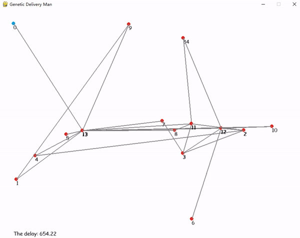
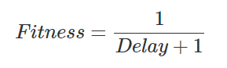
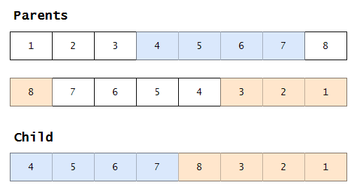
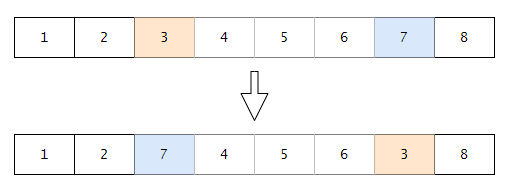
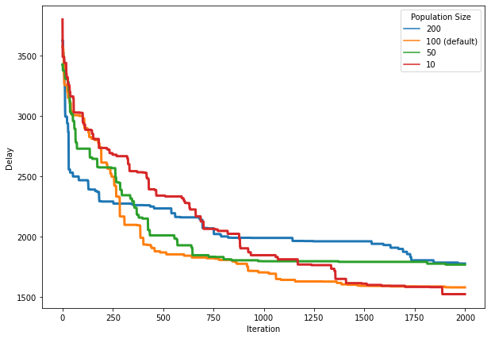
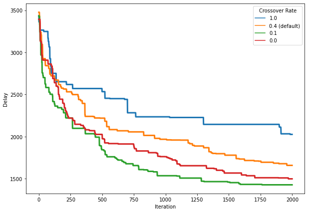
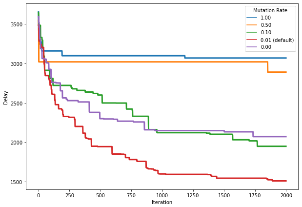
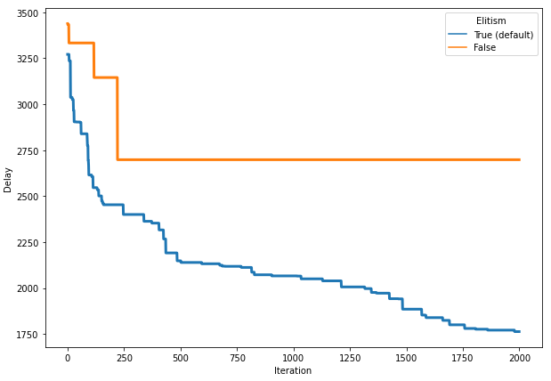
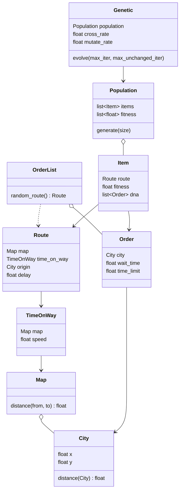

# Genetic Delivery Man

[](https://www.python.org)


## Introduction



This project uses a genetic model to solve a derivative version of the ***traveling salesman problem*** with time consideration.

> A delivery man needs to deliver some goods to customers in different cities. Every customer has been waiting for a while and has a time limit on the delivery. If the time needed is greater than a customer's limit, the exceeded is treated as a delay.

The genetic model needs to find a route that minimizes the *total delay time* for all customers.

## Getting Started

### Prerequisites

- Install [*Python 3.10*](https://www.python.org).

- Install all dependencies.

  ```bash
  pip install -r requirements.txt
  ```

### Running

```bash
python main.py
```

### Configurations

The configuration is in the `src/config.json` file.

## Data

All data are stored in the `src/data` folder.

### Cities

The city information is in the `cities.csv` file. The *first* city will automatically be set as the location of the delivery company, in other words, the starting point. And the location of each city have the following constraints:

- 0 ≤ `X` ≤ `mapSize.width`
- 0 ≤ `Y` ≤ `mapSize.height`

The values of `mapSize.width` and `mapSize.height` can be set in the configuration file.

```json
"mapSize": {
    "height": 600,
    "width": 800
}
```

### Orders

The order information is in the `orders.csv` file. Each order has the following attributes:

|  Attribute  |               Description               |
| :---------: | :-------------------------------------: |
|    `ID`     |            Unique order ID.             |
|   `City`    |            The destination.             |
| `WaitTime`  | The time the customer has been waiting. |
| `TimeLimit` |       The time limit on delivery.       |

For example, if a order's `WaitTime` is 5 and `TimeLimit` is 20, it means the customer has been waiting for 5 minutes and the delivery must be sent within the next 15 minutes. Otherwise there will be a delay.

If all orders' `WaitTime` and `TimeLimit` are equal to 0, the problem will be the same as the *traveling salesman*. The model is actually trying to find the shortest route.

## Genetic Model

### Fitness



### Crossover

The model uses *ordered crossover*. It randomly selects a subsequence of the first route, then fills the remainder with orders from the second route in the order in which they appear, without duplicate.



### Mutation

The mutation randomly swaps two orders in a route.



### Elitism

Keep the best route from the previous generation unchanged and replace the worst in the current generation with it.

### Iteration

The maximum iteration number can be set in the configuration file. There are two variables:

```json
"maxIter": {
    "total": 2000,
    "unchanged": 0
}
```

The model will stop evolution if it's iteration reaches the value of `maxIter.total`. It is always effective.

`maxIter.unchanged` can be set to 0 and the model will not consider it. When it is larger than 0, the model will stop if the best individual remains unchanged over `maxIter.unchanged` iterations.

The console will show the detail of iterations.

```console
(344) Update the shortest delay: 1180.45 -> 1149.62
	0 -> 1 -> 4 -> 5 -> 13 -> 7 -> 8 -> 11 -> 3 -> 12 -> 2 -> 10 -> 6 -> 9
(416) Update the shortest delay: 1149.62 -> 1145.07
	0 -> 1 -> 4 -> 5 -> 13 -> 7 -> 8 -> 11 -> 12 -> 2 -> 10 -> 3 -> 6 -> 9
The shortest delay: 1145.07
	0 -> 1 -> 4 -> 5 -> 13 -> 7 -> 8 -> 11 -> 12 -> 2 -> 10 -> 3 -> 6 -> 9
```

## Test Statistics

The default configuration is:

```json
{
    "speed": 100,

    "mapSize": {
        "height": 600,
        "width": 800
    },

    "elitism": true,

    "populationSize": 100,

    "rate": {
        "cross": 0.4,
        "mutate": 0.01
    },

    "maxIter": {
        "total": 2000,
        "unchanged": 0
    }
}
```

Before the test, 50 orders were randomly generated. Each order has a unique city as its destination. Their `WaitTime` and `TimeLimit` are equal to 0.

```
ID,City,WaitTime,TimeLimit
0,1,0.0,0.0
1,2,0.0,0.0
2,3,0.0,0.0
3,4,0.0,0.0
```

When testing a variable, the others are fixed.

### Population Size



### Crossover Rate



### Mutation Rate



### Elitism



## Class Diagram



## Dependencies

- [*pygame*](https://www.pygame.org)
- [*pandas*](https://pandas.pydata.org)
- [*NumPy*](https://numpy.org)

## License

Distributed under the *MIT License*. See `LICENSE` for more information.